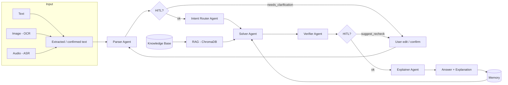

# Math Mentor – Multimodal RAG + Agents + HITL + Memory

A JEE-style **Math Mentor** that accepts **image**, **audio**, or **text** input, runs a **RAG pipeline** and **multi-agent system**, and supports **human-in-the-loop (HITL)** and **memory** for learning.

---

## Deliverables (submission)

| Item | Link / status |
|------|----------------|
| **GitHub repository** | https://github.com/abhisek-futx-da/AI_math_Solver_Agent |
| **Live app** | [Add your deployed app URL here, e.g. Streamlit Cloud / Hugging Face] |
| **Demo video (3–5 min)** | [Add link: image→solution, audio→solution, HITL, memory reuse] |
| **Evaluation summary** | See [EVALUATION.md](EVALUATION.md) |

**Before submitting**, fill in the links above (repo, live app, demo video).

### Pushing to GitHub

1. **Create a new repository** on [GitHub](https://github.com/new) (e.g. `math-mentor`). Do not add a README or .gitignore (this repo has them).

2. **From your project folder** (ensure `.env` is not staged — it’s in `.gitignore`):
   ```bash
   git init
   git add .
   git status   # confirm .env and chroma_data/ do NOT appear
   git commit -m "Initial commit: Math Mentor app"
   git branch -M main
   git remote add origin https://github.com/YOUR_USERNAME/YOUR_REPO.git
   git push -u origin main
   ```

3. **Never commit** `.env` or any file with API keys. If you already committed `.env` by mistake, remove it from git (keep the file locally):  
   `git rm --cached .env` then commit and push.

---

## Features

- **Multimodal input**: Type, upload image (OCR), or upload audio (ASR with Whisper)
- **Guardrail Agent** *(bonus)*: Filters non-math or harmful inputs before processing
- **Parser Agent**: Cleans input → structured problem (topic, variables, constraints); triggers HITL if ambiguous
- **Intent Router**: Classifies problem (algebra, probability, calculus, linear algebra)
- **Solver Agent**: Solves using RAG (ChromaDB + sentence-transformers embeddings) over a curated 12-doc math knowledge base
- **Verifier Agent**: Checks correctness, domain, edge cases; suggests HITL if unsure
- **Explainer Agent**: Step-by-step student-friendly explanation
- **Memory**: Stores interactions and feedback; retrieves similar past problems for pattern reuse
- **UI**: Streamlit – input mode, extraction preview, agent trace, retrieved context, answer, confidence, feedback (✅ correct / ❌ incorrect + comment / 🔁 request re-check HITL)
- **HITL (all 4 triggers)**: Low OCR/ASR confidence, parser ambiguity, verifier uncertainty, explicit user re-check request

## Setup

1. **Clone and enter the repo**
   ```bash
   cd ai_planet
   ```

2. **Create a virtual environment (recommended)**
   ```bash
   python -m venv .venv
   source .venv/bin/activate   # Windows: .venv\Scripts\activate
   ```

3. **Install dependencies**
   ```bash
   pip install -r requirements.txt
   ```

4. **Set your OpenRouter API key**
   - Copy `.env.example` to `.env`
   - Edit `.env` and set:
     ```
     OPENROUTER_API_KEY=your_openrouter_api_key_here
     ```
   - Get a key from [OpenRouter](https://openrouter.ai/keys). Chat uses OpenRouter; embeddings use sentence-transformers (local, no key).

5. **Run the app**
   ```bash
   streamlit run app.py
   ```
   Open the URL shown (e.g. http://localhost:8501).

## Architecture (high level)



- **RAG**: Documents in `knowledge_base/` (12 curated .md files) are chunked, embedded with sentence-transformers, and stored in ChromaDB. The Solver retrieves top-k chunks and uses them in the prompt. Chat uses OpenRouter (one API key).
- **HITL**: Triggered when (1) OCR/ASR confidence is low, (2) Parser sets `needs_clarification`, (3) Verifier sets `suggest_recheck`, or (4) User clicks the 🔁 "Request Human Re-check" button.
- **Memory**: Each interaction (input, parsed, solution, verifier result, feedback) is stored. Similar past problems are retrieved (by embedding similarity) and shown for pattern reuse.

## Project layout

- `app.py` – Streamlit UI and pipeline orchestration
- `config.py` – Config and env (e.g. `OPENROUTER_API_KEY`, `OPENROUTER_MODEL`, `RAG_TOP_K`)
- `llm_client.py` – OpenRouter for chat, sentence-transformers for embeddings
- `rag_pipeline.py` – Chunk, embed, ChromaDB index, retrieve
- `knowledge_base/` – 12 curated .md files (formulas, templates, pitfalls, JEE strategies)
- `agents/` – Guardrail, Parser, Router, Solver, Verifier, Explainer (6 agents)
- `input_handlers/` – OCR (EasyOCR), ASR (Whisper), text
- `memory/` – Store interactions, retrieve similar
- `.env.example` – Example env (copy to `.env`)

## Deployment (e.g. Streamlit Community Cloud)

1. Push the repo to GitHub.
2. Go to [share.streamlit.io](https://share.streamlit.io), connect the repo.
3. Set **Secrets** (or env in your platform): `OPENROUTER_API_KEY = "your_key"`.
4. Main file: `app.py`, command: `streamlit run app.py`.
5. After deploy, add your **Live app** URL in the [Deliverables](#deliverables-submission) table above.

Note: OCR (EasyOCR) and ASR (Whisper) need more memory/CPU on free tiers; for a minimal cloud demo you can disable image/audio and keep only text.

## Evaluation summary

See **[EVALUATION.md](EVALUATION.md)** for the full evaluation summary. In brief:

- **RAG**: Curated KB (algebra, probability, calculus, linear algebra); retrieval in Solver; no hallucinated citations.
- **Agents**: 5 agents (Parser, Intent Router, Solver, Verifier, Explainer).
- **HITL**: On low OCR/ASR confidence, parser ambiguity, and verifier uncertainty.
- **Memory**: Stored interactions and feedback; similar-problem retrieval for reuse.

## License

MIT.
