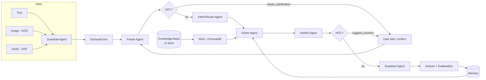

# Math Mentor – Multimodal RAG + Agents + HITL + Memory

A JEE-style **Math Mentor** that accepts **image**, **audio**, or **text** input and runs a multi-agent pipeline with **RAG**, **HITL**, and **memory**.

---

## Deliverables

| Item | Link |
|------|------|
| **GitHub repository** | https://github.com/abhisek-futx-da/AI_math_Solver_Agent |
| **Live app** | https://eppupbenuujfgekwjwgx8i.streamlit.app |
| **Demo video (3–5 min)** | https://drive.google.com/file/d/1Cb3WnVGCWhxfLEGqjlKf3vEA7Dk_Ew6k/view?usp=sharing |
| **Evaluation summary** | [EVALUATION.md](EVALUATION.md) |

---

## Features

- **Multimodal input**: Text typing, image upload (EasyOCR), audio upload (Whisper ASR)
- **Guardrail Agent** *(bonus)*: Validates input is a math question before processing
- **Parser Agent**: Cleans OCR/ASR output into a structured problem (topic, variables, constraints, HITL flag)
- **Intent Router Agent**: Classifies topic — algebra, probability, calculus, linear algebra
- **Solver Agent**: Generates step-by-step solution using RAG context (ChromaDB + sentence-transformers) from a 12-doc knowledge base
- **Verifier Agent**: Checks correctness, units/domain, edge cases; flags HITL if confidence is low
- **Explainer Agent**: Produces student-friendly step-by-step explanation
- **HITL (all 4 triggers)**:
  1. OCR/ASR confidence is low — show extraction preview, let user edit before solving
  2. Parser detects ambiguity (`needs_clarification`) — pipeline pauses, user must clarify
  3. Verifier is not confident (`suggest_recheck`) — HITL flag shown in sidebar
  4. User explicitly clicks "Request Human Re-check" button — flags and stores the interaction
- **Memory**: Every interaction stored (input, parsed, solution, verifier outcome, feedback); similar past problems retrieved by embedding similarity for pattern reuse
- **Feedback loop**: Correct / Incorrect + comment — stored for self-learning

---

## Quick Start (local)

```bash
# 1. Clone
git clone https://github.com/abhisek-futx-da/AI_math_Solver_Agent.git
cd AI_math_Solver_Agent

# 2. Install dependencies
pip install -r requirements.txt

# 3. Set API key
cp .env.example .env
# Edit .env and set OPENROUTER_API_KEY=sk-or-v1-...

# 4. Run
streamlit run app.py
```

Get an API key at [openrouter.ai/keys](https://openrouter.ai/keys) (free tier available). Embeddings use local sentence-transformers — no additional API key required.

---

## Architecture



**RAG**: 12 curated `.md` files in `knowledge_base/` (algebra, calculus, trigonometry, probability, linear algebra, integration, sequences/series, coordinate geometry, JEE strategies, solution templates, common mistakes, domain constraints). Chunked, embedded locally (sentence-transformers/all-MiniLM-L6-v2), indexed in ChromaDB. Solver retrieves top-k chunks with no hallucinated citations.

**Memory**: `memory/store.py` stores each interaction. On the next solve, it retrieves the top-3 most similar past problems by cosine similarity and shows them in the UI for pattern reuse. No model retraining.

---

## Project Layout

```
app.py                  # Streamlit UI + pipeline orchestration
config.py               # Config (OPENROUTER_API_KEY, model, RAG_TOP_K)
llm_client.py           # OpenRouter chat + sentence-transformers embeddings
rag_pipeline.py         # Chunk, embed, ChromaDB index, retrieve
agents/
  guardrail_agent.py    # [bonus] Input validation
  parser_agent.py       # Problem parsing + HITL flag
  router_agent.py       # Intent routing
  solver_agent.py       # Solution generation with RAG
  verifier_agent.py     # Solution verification + HITL flag
  explainer_agent.py    # Student-friendly explanation
input_handlers/
  ocr.py                # EasyOCR image extraction
  asr.py                # Whisper ASR transcription
  text.py               # Text cleaning
knowledge_base/         # 12 curated .md files
memory/
  store.py              # Persist + retrieve similar interactions
.env.example            # API key template
Dockerfile              # Docker build
render.yaml             # Render deployment config
packages.txt            # System packages for cloud deployment
```

---

## Evaluation Summary

Full detail in [EVALUATION.md](EVALUATION.md). Key points:

| Component | Status |
|-----------|--------|
| RAG pipeline (12 docs, ChromaDB, sentence-transformers) | Complete |
| 6 agents (including bonus Guardrail) | Complete |
| All 4 HITL triggers | Complete |
| Memory + self-learning (feedback loop) | Complete |
| Multimodal input (Text / Image / Audio) | Complete |
| Live deployment (Streamlit Cloud) | Complete |

---

## License

MIT
